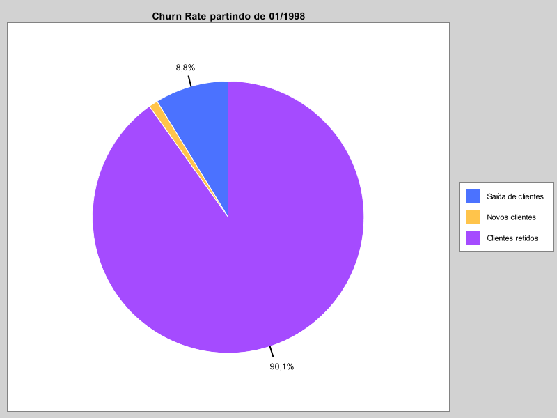

# Data Analysis in Scala
- Projeto analítico que utiliza Apache Spark para processar dados de clientes e vendas, gerando insights sobre churn, padrões de compras e ticket médio. As visualizações criadas com XChart e Plotly e os resultados exportados permitem uma análise detalhada para apoiar decisões estratégicas e melhorar a retenção e o desempenho comercial.

## Organização de arquivos
1. //data: onde fica localizado os arquivos csv.
2. //charts: para aonde os graficos são enviados.
3. //src//main//scala: onde fica os códigos em scala:

## /docs
-  Documentação:
1. REQUISITOS.docx
2. Slide.pdf

# Churnrate.scala
## Objetivo:
Analisar a taxa de churn (rotatividade de clientes) categorizando clientes em três grupos: os que saíram antes de 1998, novos clientes desde janeiro de 1998, e clientes retidos. Um gráfico de pizza é gerado para representar essas categorias.

## O que faz:
O código utiliza Spark para processar dados de compras e clientes, realizando transformações como filtragens por datas específicas e cálculos de categorias. Ao final, usa a biblioteca XChart para criar e salvar um gráfico de pizza que resume visualmente os grupos de clientes analisados.

## O Código utiliza os arquivos:
1. customers.csv
2. orders.csv
3. first_purchase.csv
4. last_purchase.csv

- O gráfico gerado com o nome  “churn_rate_chart.png” é adicionado à pasta charts 

# GraficosChurn.scala
## Objetivo:
Criar visualizações dinâmicas em HTML para explorar padrões temporais nas compras e proporções entre compras iniciais e finais, com foco na análise de desempenho por período e por colaborador.

## O que faz:
Este código monta gráficos interativos usando a biblioteca Plotly, como gráficos de barras empilhadas para analisar compras ao longo do tempo e gráficos de barras simples para comparar métricas entre funcionários. Ele salva as visualizações em arquivos HTML, que podem ser abertos diretamente no navegador.

- O gráfico é gerado em formato HTML com os nomes “first_last_purchase_dates_by_customer.html” e “first_last_purchase_ratio_by_employee.html” adicionados à pasta charts.

# TicketMedio.scala
## Objetivo:
Calcular o ticket médio (valor médio por pedido) a partir dos dados de pedidos e gerar um arquivo de texto com os resultados para análise posterior.

## O que faz:
O programa utiliza Spark para processar dados de detalhes dos pedidos, calculando o valor total por pedido considerando preço unitário, quantidade e descontos. Os resultados são exportados para um arquivo .txt, e o fluxo é gerenciado com validações para garantir que os arquivos de entrada sejam carregados corretamente antes de iniciar os cálculos.

## O Código utiliza os arquivos:
1. customers.csv
2. orders.csv
3. order_details.csv

- O arquivo txt é gerado com o nome "ticket_medio.txt" é adicionado a pasta charts.